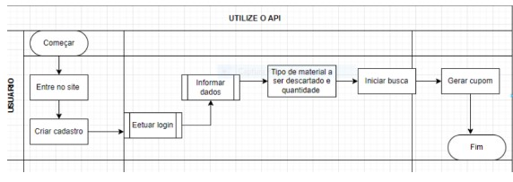
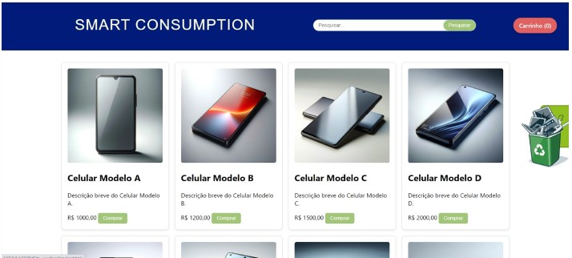
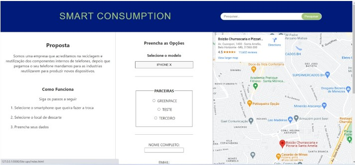
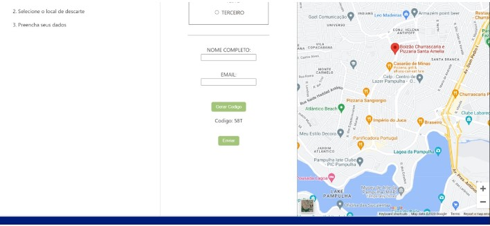
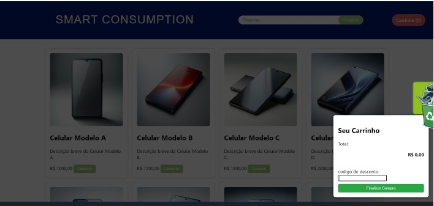
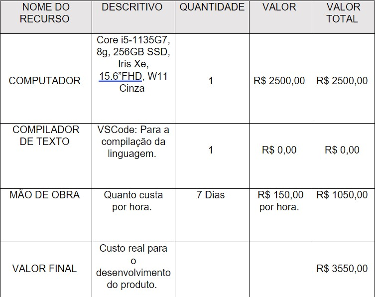

# Descarte Eletrônico
##
## Resumo 
Nosso projeto de UPX tem o objetivo de conscientizar as pessoas sobre o impacto ambiental dos dispositivos eletrônicos que elas compram. Para isso, criamos uma API que pode ser integrada em sites de venda de eletrônicos. A API mostra um ícone flutuante na tela que, ao ser clicado, leva o usuário para o nosso site. Lá, ele pode encontrar informações sobre como escolher, usar e descartar os dispositivos de forma sustentável. Além disso, ele pode participar de ações de reciclagem e doação de eletrônicos usados. Queremos mostrar que é possível consumir tecnologia de forma responsável e ecológica.
##
# PROPOSTA E PROPÓSITOS DO PROJETO 
Ao adquirirem novos dispositivos eletrônicos, as pessoas frequentemente negligenciam a questão do descarte adequado de seus equipamentos antigos, contribuindo, assim, para um acúmulo alarmante de resíduos eletrônicos. Portanto, foi desenvolvido o projeto "API-SMART CONSUMPTION", com o objetivo de conscientizar e incentivar os consumidores a realizarem o descarte adequado de seus dispositivos antigos ao adquirirem novos. 

 

O projeto tem como propósito reforçar a conscientização do consumidor, incentivando-o a realizar o descarte adequado por meio da liberação de um cashback, que será emitido assim que o descarte for confirmado. Logo, a aplicação da API não promove apenas uma prática mais sustentável e responsável por parte dos consumidores, mas também busca reduzir o problema do acúmulo de lixo eletrônico e o descarte inadequado desses equipamentos.  

# OBJETIVOS 

## OBJETIVO GERAL  

Desenvolver um API online com linguagem de programação e frameworks para orientar sobre os descartes de E-lixos. 

## OBJETIVO DO PRODUTO 

O Smart Consumption será um API público que será integrado a um site modelo de compras de eletrônicos, em sua composição será realizado o uso da linguagem de programação Typescript e um ambiente de execução em uma máquina virtual própria para implementar e executar os scripts de forma autônoma, no caso NodeJs.   

Para desenvolvê-lo o API integrará os dados do local de descarte mais próximo do usuário via “Endpoints”(Endereços na internet que são interligados aquela API, exemplo: um site com o local e descrição de um ponto verde) através dessas informações o usuário verá a localização dos descartes mais próximos. Caso o indivíduo opte por doar o aparelho é desejável compensá-lo futuramente, no momento da confirmação do pagamento, com um cashback no próprio site.  

A finalidade do projeto é permitir que o usuário tenha acesso a uma interface interativa em lojas online de eletrônicos, que disponibilize informações para o descarte adequado de seu antigo aparelho, no mesmo site em que ele irá adquirir o seu novo.  

 

# JUSTIFICATIVA 
Tendo como referência estes objetivos o projeto pretende reduzir a produção do E-lixo ou lixo tecnológico, que representam qualquer equipamento eletrônico que não esteja mais em uso. Segundo Ghebreyesus (2021), diretor-geral da OMS (Organização Mundial de Saúde) “Com volumes crescentes de produção e descarte, o mundo enfrenta o que um recente fórum internacional descreveu como um crescente ‘tsunami de lixo eletrônico’, colocando vidas e a saúde em risco, Da mesma forma que o mundo se uniu para proteger os mares e seus ecossistemas da poluição por plásticos e microplásticos, precisamos nos unir para proteger nosso recurso mais valioso - a saúde”. 

 Marques (2023) disse que, muitos dispositivos eletrônicos contêm substâncias tóxicas, como mercúrio, chumbo e cádmio, que podem vazar para o solo e a água se os dispositivos forem descartados inadequadamente em aterros sanitários. Além disso, a produção de eletrônicos requer a extração de recursos naturais, o que contribui para a degradação ambiental. 

E de acordo com a publicação da Green Eletron com informações da pesquisa Resíduos eletrônicos no Brasil – 2021. O Brasil é o quinto maior gerador desse lixo no mundo. Mesmo assim, muita gente ainda não sabe o que é esse tipo de resíduo e como ele deve ser descartado para evitar danos ao meio ambiente e à saúde humana, AGENCIABRASIL (2021). 

De acordo com os Objetivos do Desenvolvimento Sustentável (ODS) nosso projeto se enquadra no objetivo 12, que respectivamente, reduzir substancialmente a geração de resíduos por meio da prevenção, redução, reciclagem e reuso. 

Com o intuito de minimizar esse quadro o projeto tem como diferencial incentivar o descarte e facilitar as informações quanto aos locais adequados que recebem ou coletam esse lixo eletrônico e fazer parcerias com empresas que fazem a reciclagem do produto. 

 

# MÉTODOS 

O projeto consiste na representação de como será a utilização de um API dentro de um site para realização de busca de locais onde descartar de maneira adequada o lixo eletrônico do usuário.    

Para desenvolver o API com as funcionalidades desejadas, foram realizadas pesquisas e optou se pelas linguagens de programação Javascript e Node.js, pois a linguagem Javascript permite que vários efeitos sejam inseridos no API tornando o mais dinâmico e possibilita a execução de instruções como resposta às ações dos usuários.  
As dimensões do API que ficaram visíveis em tela serão: 4cm de altura x 6 de largura. O modelo virtual foi escolhido pensando na facilidade que a tecnologia possui para fornecer informações e conectar pessoas independentemente de onde estejam, acredita-se que um modelo virtual venha a alcançar um maior número de usuários. Sendo assim, não possui princípios físicos para serem listados. 

Visando incentivar o uso do Smart Consumption por um maior número de pessoas, foi decidido que o API seria totalmente gratuito. Assim, espera-se que a falta de custos seja um estímulo para que mais indivíduos utilizem a plataforma. 

Com a ideia do projeto bem definida e as formas de desenvolvimento selecionadas, foi elaborado o documento de UPX 2, contendo o objetivo, a proposta, o propósito e a justificativa para a resolução do problema do descarte irregular de lixo eletrônico. 

  

A interface de programação de aplicação (API) será implementada no âmbito de um website, para o qual será criado um formato visual simples utilizando HTML, com o intuito de representar a forma como os dados da API serão consumidos e exibidos. A criação de uma API não é um processo simples, sendo que demanda considerável esforço e recursos financeiros. Ao contrário de um software sem uma API, a implementação de um sistema com API requer uma maior dedicação de trabalho.  

No entanto, ao disponibilizarmos uma API, tem se a possibilidade de criar sistemas mais avançados e diminuir sua complexidade, de forma a facilitar sua compreensão. 

  

 A criação da API foi dividida em um passo a passo de acordo com as seguintes etapas: 

No primeiro passo, o Node.js foi instalado na máquina para possibilitar o desenvolvimento e a validação da API. No segundo passo, o IDE (Ambiente de desenvolvimento integrado) foi configurado para iniciar o projeto. No terceiro passo, foi feita a estruturação do projeto, com a criação de uma organização de pasta e arquivos. O quarto passo consistiu na criação do arquivo ‘server’, que será utilizado como arquivo de inicialização do projeto. Para organizar o código e dividir de acordo com o padrão MVC (Model-View-Controller), no quinto passo foi criado um Controller, que contém as principais ações da API. No sexto passo, foram criadas as rotas, que permitem que as requisições sejam direcionadas corretamente e que o funcionamento da API possa ser verificado. No sétimo passo, foram realizadas as configurações da base de dados. Para facilitar o desenvolvimento e evitar a necessidade de reiniciar o servidor a cada alteração, foi utilizado o node Mon no oitavo passo. No nono passo, o projeto Node será iniciado.  

Por fim, no décimo passo será realizado um processo de teste do projeto para verificar o seu funcionamento. 

 

Os metodologia para o desenvolvimento do protótipo pode ser observada no fluxograma representado na figura.  

 

IMAGEM 1 – FLUXOGRAMA DO TRABALHO 

 

FONTE: Autoria própria 

REFERÊNCIAS  

AUTOR Thiago Adriano 

https://imasters.com.br/front-end/criando-uma-api-node-em-10-passos-com-express-js  

 

 

# RESULTADOS 

Esta fase do projeto marca a entrega do produto final, o “API-Smart Consumption”. O projeto apresenta características como a integração com um site de compras de eletrônicos, orientação sobre o descarte de e-lixos, a emissão de cashback na confirmação de entrega do aparelho ao local de descarte incentivando um descarte adequado, e a oferta gratuita do serviço, visando estimular seu uso por um maior número de pessoas. O site, a API e a integração entre eles foram desenvolvidos utilizando HTML, CSS e JavaScript, por meio do Visual Studio Code (VSCode). 

Ao concluir o protótipo do projeto, a equipe empreendeu uma análise minuciosa, registrando cada etapa para um resultado mais próximo do que foi proposto. Esse processo não só contribui para uma compreensão profunda do projeto, mas também promove uma cultura de aprendizado contínuo, demonstrando o compromisso da equipe com a excelência em futuros empreendimentos. 

A versão final do produto é apresentada a seguir por meio de capturas de telas de funcionamento, proporcionando uma representação visual abrangente. 

Tela inicial: Página modelo de e-commerce, onde o usuário pode navegar pelos produtos da loja e posteriormente, escolher algum produto, adicionar ou remover do carrinho. Além disso, aqui fica o ícone do API na borda da página. 

IMAGEM 1: PÁGINA INICIAL DO E-COMMERCE. 

Interface gráfica do usuário

Descrição gerada automaticamente 

FONTE: Autoria própria. 

Segunda tela: É a primeira parte do API, onde o usuário pode conhecer a proposta do projeto, como funciona o processo, e inserir os dados na coluna “Preencha as Opções”. Também é aqui onde é apresentado o mapa em tempo real, onde futuramente, em uma possível atualização do site e do API, seria possível verificar a localização das organizações parceiras do projeto e ver qual é mais próxima do indivíduo. 

 

IMAGEM 2 – PÁGINA INICIAL DO API. 

Interface gráfica do usuário, Aplicativo

Descrição gerada automaticamente 

FONTE: Autoria própria. 

IMAGEM 3 – CONTINUAÇÃO DO API. 

Uma imagem contendo Site

Descrição gerada automaticamente 

FONTE: Autoria Própria. 

Terceira tela: Carrinho de compras: um local onde o cliente pode revisar os itens selecionados, adicionar ou remover produtos e concluir a compra. Além disso, no carrinho, há um campo para "Código de Desconto", onde o cliente, após ter o processo de descarte validado com a organização parceira e receber seu cupom, poderá usá-lo em compras futuras para obter um desconto no valor final. 

 

IMAGEM 4 – CARRINHO DE COMPRAS 

Interface gráfica do usuário

Descrição gerada automaticamente 

FONTE: Autoria própria. 

O produto funciona conforme as especificações previstas, destacando-se por oferecer uma plataforma em que, quando o usuário tem um dispositivo eletrônico a ser descartado, pode seguir as orientações da página, escolher o modelo do aparelho e preencher seus dados. Ao ser confirmado o processo, um cupom de desconto é disponibilizado para ser utilizado em uma próxima compra. Todavia, observou-se uma limitação no mapa da API, cujo objetivo era proporcionar ao usuário acesso aos "Endpoints" mais próximos. Contudo, por motivos técnicos, não foi possível alcançar esse objetivo. 

A análise dos resultados em relação aos Objetivos do Produto revela conquistas notáveis. Objetivos como ser uma API pública integrada a um modelo de site de venda de eletrônicos e oferecer um "cashback" quando o usuário descarta um eletrônico, com o processo sendo validado, foram alcançados com sucesso. No entanto, outros objetivos, como apresentar a localização das organizações parceiras mais próximas do usuário, enfrentaram desafios e não foram totalmente alcançados, permanecendo como sugestão para futuras melhorias do projeto. 

O custo real do produto manteve-se em conformidade com o planejamento inicial, evidenciando a ausência de alterações significativas durante o processo de desenvolvimento. Esses valores podem ser visualizados na tabela 2: 

 

TABELA 2 – VALORES FINAIS PARA O DESENVOLVIMENTO DO PRODUTO 

 
FONTE: Autoria própria. 

 

 CONCLUSÃO 

A conclusão do projeto o API-Smart Consumption representa não apenas a conclusão do objetivo estabelecido do produto, sendo o mesmo um API público que será integrado a um site modelo de compras de eletrônicos, com linguagem de programação e frameworks para orientar sobre os descartes de E-lixos, permitindo que o usuário tenha acesso a uma interface interativa em lojas online de eletrônicos, que disponibilize informações para o descarte adequado de seu antigo aparelho, mas, também reflete o compromisso do grupo com a inovação. Com a integração eficiente do API-Smart Consumption em um site de compras de eletrônicos, a orientação sobre o descarte de lixos eletrônicos, junto a oferta de um cashback demonstram um impacto positivo na conscientização ambiental. 

Ao decorrer do desenvolvimento do projeto, considerando o custo levantado inicialmente, não foram necessários novos investimentos e gastos, mantendo-se os mesmos valores especulados pelo grupo no levantamento de materiais e ao longo do processo. 

Durante a elaboração do projeto alguns pontos foram destacados caso o projeto tivesse continuidade, no qual poderiam ser implementados como melhoria na experiência do usuário e no desempenho do API, como a visualização dos locais de descarte parceiros no mapa, visto que para sua implementação seria necessário um valor muito alto. Outro fator importante seria referente ao cashback, que devido à falta de conhecimento técnico necessário, não foi possível implantar, mas, como forma de suprir a ideia, o grupo decidiu optar por gerar um código para ser utilizado para desconto (como registrado nas etapas anteriores). 

A adição do projeto no cotidiano das pessoas, na compra de eletrônicos e efetuando assim o descarte correto de seu antigo aparelho, contribuirá não apenas para o grupo, mas também para o planeta como um todo, demonstrando assim o impacto positivo que iniciativas inovadoras podem ter em escala global. Concluindo que o projeto foi uma excelente oportunidade para demonstrar a criatividade, mostrando o compromisso com soluções inovadoras e sustentáveis.   

 
REFERÊNCIAS 

Aumento do lixo eletrônico afeta saúde de milhões de crianças, alerta OMS. [S. l.], 15 jun. 2021. Disponível em: https://www.paho.org/pt/noticias/15-6-2021-aumento-do-lixo-eletronico-afeta-saude-milhoes-criancas-alerta-oms. Acesso em: 27 set. 2023. 

 

MARQUES, Marina. Entenda os impactos do descarte de lixo eletrônico. [S. l.], 18 set. 2023. Disponível em: https://www.cleanipedia.com/br/sustentabilidade/descarte-de-lixo-eletronico.html. Acesso em: 27 set. 2023. 

 

Agência Brasil. Disponível em: https://agenciabrasil.ebc.com.br/. Acesso em: 27 set. 2023.Agência Brasil. Disponível em: https://agenciabrasil.ebc.com.br/. Acesso em: 27 set. 2023. 

##
## Trabalho feito por:
Ana Clara Nogueira de Souza 

Ana Cristina Gonçalves Siqueira 

Diana da Silva Alves 

Gustavo Freire Cadamuro 

Kévin Thiago dos Santos 

Rayane De Oliveira Gonçalves 

Sabrina Waldez de Souza Oliveira 
